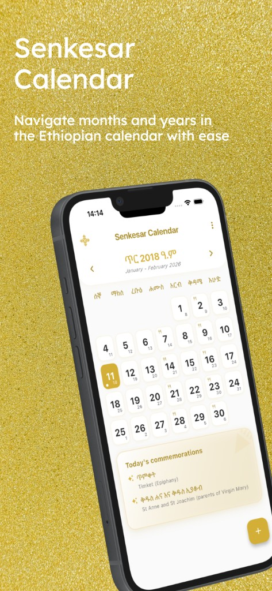
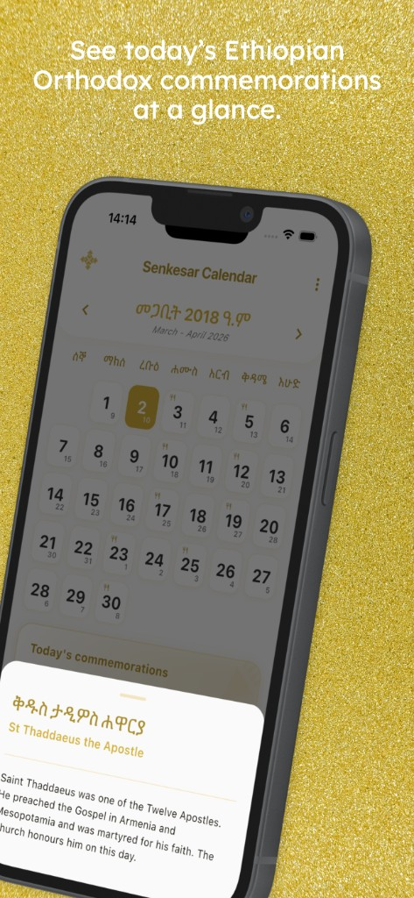
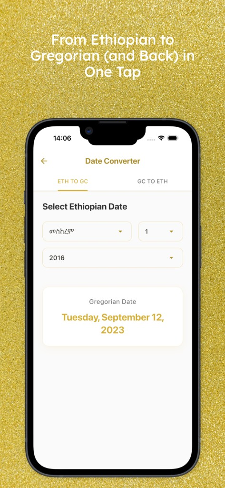
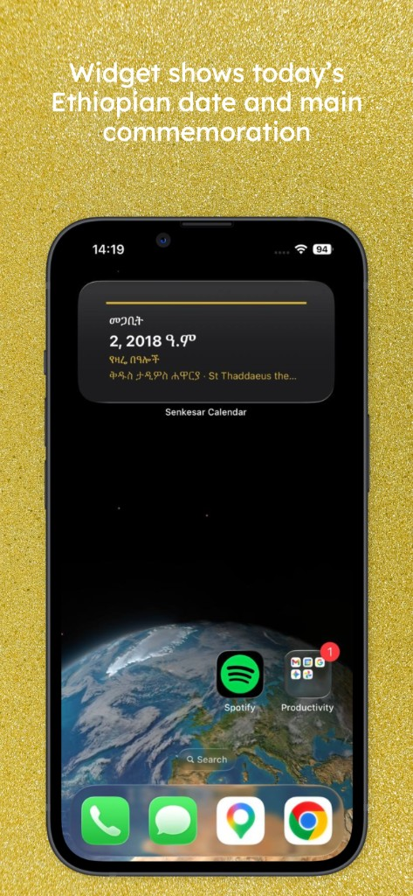

# Senkesar Calendar

**Senkesar Calendar** is an Android app for the Ethiopian Orthodox Tewahedo Church calendar. View the Ethiopian calendar, see daily commemorations (saints and feasts), convert dates between Ethiopian and Gregorian calendars, and get a home-screen widget with today’s date and main commemoration.

---

## Features

- **Ethiopian calendar** — Navigate months and years in the Ethiopian calendar with ease. Each day shows both Ethiopian and Gregorian dates.
- **Today’s commemorations** — See today’s Ethiopian Orthodox commemorations at a glance: saints, feasts, and fasting days, with short descriptions in Amharic and English.
- **Date converter** — Convert from Ethiopian to Gregorian (and back) in one tap. Pick month, day, and year and get the equivalent date instantly.
- **Search** — Quickly find feasts, saints, and special days by name or date (Amharic or English).
- **Home screen widget** — Widget shows today’s Ethiopian date and main commemoration.
- **Language** — Switch between Amharic and English.
- **Dark mode** — Light, dark, or system theme.
- **Notes** — Add personal notes to calendar days with optional reminders.

---

## Screenshots

| Calendar & commemorations | Today’s commemoration detail |
|--------------------------|------------------------------|
|  |  |

| Home screen widget | Date converter | Search |
|--------------------|-----------------|--------|
|  |  |  |

---

## Download (Android)

- **Releases:** [Releases](https://github.com/AbelaTs/Senkesar-Calendar-Public-Releases/releases) — Download the latest `Senkesar-Calendar-*.apk` for Android.

---

## Privacy

The app does not require an account. Notes and preferences are stored only on your device. For the full policy, see **[Privacy Policy](https://www.abeltsegaye.com/senkesar-calendar-privacy-policy)**.

